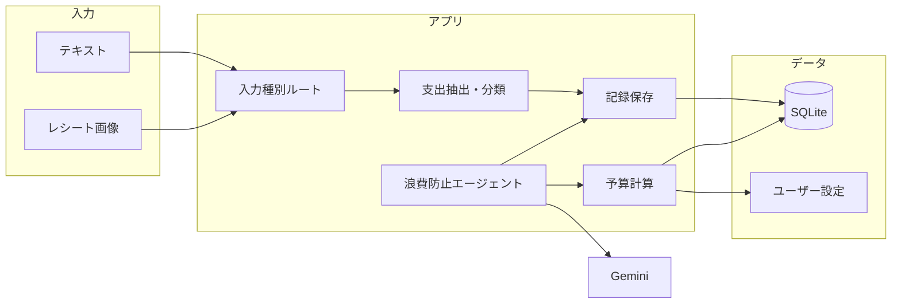

# AI家計簿アプリケーション 実装計画

## 現状

- [app.py](app.py): Chainlit + Gemini 2.5 Flash のシンプルなテキスト対話のみ。永続化・エージェント・画像入力は未実装。

---

## 全体アーキテクチャ（目標）




---

## 実装フェーズと手順

### Phase 1: データ基盤と「入力→分類→記録」（必須）

**目的**: テキスト／レシート画像から支出を抽出し、カテゴリ分類して家計簿として保存する。

1. **データモデルと永続化**
  - **DB**: SQLite（個人開発で十分。後から PostgreSQL に差し替え可能）
  - **ORM**: SQLAlchemy 2.0 または **SQLModel**（Pydantic 互換で FastAPI/Chainlit と相性良い）
  - **テーブル例**:
    - `users`: id, name（将来 LINE 連携時に LINE user_id を紐付け）
    - `budget_settings`: user_id, payday_day（給与日の「日」）, target_amount（給与日までに抑えたい支出）, updated_at
    - `expenses`: id, user_id, amount, category（食費/生活費/固定費/雑費など）, memo, date, created_at
  - マイグレーション: Alembic または SQLModel の `create_all` で初期化
2. **入力受け付け（Chainlit）**
  - テキスト: 既存の `message.content`
  - 画像: `message.elements` 内の `Image` を取得し、base64 または URL を LLM に渡す
  - Gemini 2.5 Flash はマルチモーダル対応のため、LangChain の `ChatGoogleGenerativeAI` に `HumanMessage` で `content=[{"type": "text", "text": "..."}, {"type": "image_url", "image_url": {...}}]` を渡してレシート解析可能
3. **抽出・分類（LangChain / 構造化出力）**
  - **ツール**: LLM に「テキストまたは画像から、金額・カテゴリ・メモ・日付を抽出する」プロンプトを用意
  - **構造化出力**: Pydantic モデル（例: `ExpenseItem`: amount, category, memo, date）を定義し、Gemini の structured output（`with_structured_output`）で JSON を取得 → 1件または複数件を `expenses` に INSERT
  - カテゴリは固定リスト（食費・生活費・固定費・雑費＋その他）にマッピングするようプロンプトで指示
4. **Chainlit フロー**
  - メッセージ受信時、画像ありなら「画像＋テキスト」をまとめて LLM に送る
  - 取得した `ExpenseItem` を DB に保存し、「〇〇円を〇〇として記録しました」と返す
  - ユーザー識別: 初回は `cl.user_session.get("id")` などで一時 ID。LINE 連携前は「単一ユーザー」前提でも可

**成果物**: テキスト/レシート画像 → 分類 → SQLite に記録され、Chainlit 上で確認できる。

---

### Phase 2: 予算設定と「残り日数・使用可能金額」表示（必須）

**目的**: 給与日と「給与日までに抑えたい支出」を設定し、残り日数と使用可能金額を表示する。

1. **設定の保存**
  - `budget_settings`: 給与日（毎月の「日」）、目標支出額を保存。1ユーザー1行で更新。
2. **計算ロジック**
  - 今日から次の給与日までの「残り日数」を計算
  - 今月の既存支出合計を `expenses` から集計
  - 使用可能金額 = 目標支出額 - 今月の既存支出合計（簡易版: 今月1日〜給与日の前日までで集計するか、今月全体で集計するかは仕様で決定）
3. **Chainlit での見せ方**
  - 専用アクション（例: 「予算を設定」ボタン／スレッド内で「予算設定 25日 300000」のようなコマンド）で設定
  - メッセージやウェルカム時に「残り〇日、使用可能〇〇円」を表示するブロックを返す

**成果物**: 設定に基づき「あと〇日で〇〇円使える」が分かる。

---

### Phase 3: 浪費防止エージェント（LangGraph）（必須）

**目的**: 「〇〇を買いたい」という問いに対し、残り予算と過去支出から許可/非許可と根拠を返す。

1. **LangGraph でエージェントを定義**
  - **状態**: `messages`, `remaining_budget`, `recent_expenses`, `agent_response`
  - **ノード例**:
    - `route`: ユーザー発話が「購入希望」かどうか判定（キーワードや LLM で分類）
    - `fetch_budget`: ツールで残り予算・今月の支出合計を取得
    - `fetch_expenses`: ツールで直近 N 件の支出を取得
    - `agent`: 上記ツール結果と「〇〇を買いたい」を LLM に渡し、「許可/非許可」と理由を生成
  - **エッジ**: route → fetch_budget → fetch_expenses → agent → END
  - ツールは LangChain の `@tool` で定義し、内部で DB を読む（同じ SQLite）
2. **Chainlit との接続**
  - メッセージが「購入相談」と判定されたときだけ LangGraph のグラフを実行
  - それ以外（通常の記録や予算確認）は Phase 1/2 のフロー
  - 入力ルーティング: 冒頭で「記録」「予算を見たい」「〇〇を買っていい？」などを LLM またはキーワードで振り分け
3. **プロンプト設計**
  - エージェント用システムプロンプト: 残り予算・直近支出を踏まえ、許可するかしないか、理由を日本語で簡潔に返すよう指示

**成果物**: 「このゲーム買っていい？」→「残り予算〇円、今月の娯楽費は〇円なので、許可/おすすめしません。理由は…」と返る。

---

### Phase 4（オプション）: LINE 連携

**目的**: 入力窓口を LINE にする。

1. **構成**
  - **Webhook サーバー**: FastAPI で `POST /webhook` を用意。LINE Platform からメッセージを受信。
  - **LINE Bot SDK**: `line-bot-sdk` でイベント解析（テキスト・画像）
  - **処理の共通化**: テキスト/画像を「入力」として、Phase 1〜3 のロジック（抽出・記録・予算・エージェント）を**共通モジュール**に切り出し、Chainlit からも LINE からも同じ関数を呼ぶ。
2. **ユーザー識別**
  - LINE の `userId` を `users` テーブルに紐付け。同一ユーザーで予算・支出を共有。
3. **運用**
  - ローカル開発: ngrok で HTTPS を露出し、LINE Webhook URL に設定
  - 本番: 単一 VM や Cloud Run で FastAPI + Chainlit を同居させるか、LINE は FastAPI のみで別デプロイでも可

**個人開発での現実性**: 実装可能。デプロイと Webhook 設定の手間が増えるが、ドキュメントが豊富。

---

### Phase 5（オプション）: カレンダー連携

**目的**: 未来の予定（飲み会・コンサート等）を考慮してエージェントが判断する。

1. **連携対象**
  - Google Calendar API（OAuth 2.0）で「今後 N 日間」の予定を取得
2. **データの使い方**
  - エージェントのツールに `get_upcoming_events` を追加。予定タイトルや説明から「支出が発生しそうなイベント」を LLM に渡す。
  - プロンプトで「今週末の飲み会を考慮すると、その分を残すと〇円しか残らないので、この買い物は控えめに」のような判断をさせる。
3. **実装コスト**
  - OAuth の実装、トークン保存、スコープ（読み取りのみ）の管理が必要。個人開発では「カレンダー連携 ON のユーザー」だけオプションで有効にする形が現実的。

**個人開発での現実性**: 可能だが、OAuth と権限設計の負荷は Phase 4 より大きい。後回し推奨。

---

## 推奨実装順序（まとめ）


| 順番  | 内容                                            | 目安工数（個人） |
| --- | --------------------------------------------- | -------- |
| 1   | Phase 1: データモデル、入力→分類→記録（テキスト＋画像）             | 3〜5日     |
| 2   | Phase 2: 予算設定、残り日数・使用可能金額の計算と表示               | 1〜2日     |
| 3   | Phase 3: LangGraph 浪費防止エージェント、Chainlit ルーティング | 3〜5日     |
| 4   | Phase 4: LINE Webhook、共通ロジックの切り出し             | 2〜4日     |
| 5   | Phase 5: Google Calendar 連携、エージェントツール追加       | 2〜4日     |


---

## 個人開発で「現実的にどこまでやるか」

- **必ず実装すべき（MVP）**: Phase 1〜3  
  - テキスト/レシート入力 → 分類・記録、予算表示、浪費防止エージェントまで。Chainlit だけで一通り体験できる。**ここまでなら 1〜2 週間で形にできる。**
- **LINE（Phase 4）**: 個人開発で十分現実的。  
  - 共通レイヤーを先に作っておけば、LINE は「もう一つの入力フロント」として追加するだけ。
- **カレンダー（Phase 5）**: 実装可能だが負荷はやや大。  
  - OAuth と「予定→支出予測」のプロンプト設計が必要。MVP と LINE を動かしてから検討するのがおすすめ。
- **技術的な注意**
  - Gemini の無料枠（1日あたりリクエスト数制限）に注意。開発中は呼び出し回数を抑えるか、有料枠を検討。
  - レシート画像は「枚数×LLM呼び出し」になるため、連続アップロード時は制限やバッチ化を検討するとよい。

---

## ディレクトリ構成案（Phase 3 まで）

```
ai-kakeibo/
├── app.py              # Chainlit エントリ、ルーティング
├── .env
├── requirements.txt
├── models/             # SQLModel のモデル定義
│   └── db.py
├── services/           # ビジネスロジック（記録・予算計算）
│   ├── expense.py
│   └── budget.py
├── agent/              # LangGraph 浪費防止エージェント
│   ├── graph.py
│   └── tools.py
├── prompts/            # プロンプト文字列（必要なら）
│   └── ...
└── migrations/         # Alembic（任意）
```

まずは **Phase 1 → 2 → 3** の順で進め、動作する MVP を Chainlit 上で完成させてから、LINE やカレンダーを追加する流れが現実的です。