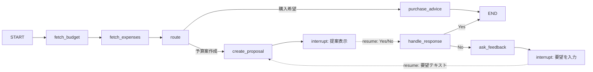

# 共通＋分岐＋予算案 Yes/No ループの LangGraph 構造

## グラフ全体像

- **共通**: ユーザー設定予算取得 → 今までの支出取得 → **ルート**（ここまで共通）。
- **分岐1（浪費防止）**: ルート → 購買希望用アドバイスノード → END。
- **分岐2（予算案）**: ルート → 予算案作成ノード → **interrupt（提案表示）** → resume で Yes/No → 応答処理ノード → Yes なら END、No なら要望入力用 **interrupt** → resume で要望テキスト → 再び予算案作成（ループ）。Yes が来るまでループ。

---

## 1. 状態（State）の拡張

**ファイル**: [kakeibo/agent/graph.py](kakeibo/agent/graph.py)（または予算案用状態を別 TypedDict にして共通 state と併用）

現在の `AgentState` に以下を追加（または共通グラフ用に 1 つの State にまとめる）:

- `user_id`, `messages`（現在のユーザー入力）, `remaining_budget`, `recent_expenses`, `agent_response`（浪費防止の返答用）  
- 予算案用: `proposal_text`（表示用）, `proposal_amounts`（カテゴリ→円の辞書。JSON 化可能な形）, `user_response`（Yes/No の結果）, `user_feedback`（No 時の要望テキスト）, `flow`（`"purchase"` | `"budget_proposal"`、ルート結果の記録用）

interrupt の resume で渡す値は、invoke 時に `Command(resume=...)` で渡し、ノード内で `interrupt()` の戻り値として state に載せる想定。

---

## 2. ノード一覧と役割

| ノード名                | 役割                                                                                                                                                                                                                                                          |
| ------------------- | ----------------------------------------------------------------------------------------------------------------------------------------------------------------------------------------------------------------------------------------------------------- |
| **fetch_budget**    | 既存どおり。ユーザー設定予算・残り日数・使用可能金額を取得し state に格納。                                                                                                                                                                                                                   |
| **fetch_expenses**  | 既存どおり。直近の支出を取得し state に格納。                                                                                                                                                                                                                                  |
| **route**           | `state["messages"]` を見て「購入希望」か「予算案作成」かを判定し、次のノード名を返す。条件エッジの分岐元。                                                                                                                                                                                             |
| **purchase_advice** | 既存の agent ノード。残り予算・支出を踏まえ購買アドバイスを生成し `agent_response` に書き、END。                                                                                                                                                                                              |
| **create_proposal** | 残り予算・残り日数（と必要ならカテゴリ別支出）からカテゴリ別予算案を LLM 構造化出力で作成。初回は新規作成、`user_feedback` がある場合は要望を踏まえて再編成。`proposal_text` と `proposal_amounts` を state に書き、`**interrupt(proposal_text)` で一旦停止**。resume 時にユーザー入力が `interrupt()` の戻り値として渡る想定で、その値を `user_response` に書き、次のノードへ。 |
| **handle_response** | `user_response`（Yes/No）を解釈。Yes → END。No → 要望入力促進メッセージを state に書き、`**interrupt("要望を教えてください")` で停止**。resume 時の入力が要望テキストなので、それを `user_feedback` に書き、**create_proposal へエッジ**（ループ）。                                                                             |

---

## 3. エッジ定義

- `START` → `fetch_budget` → `fetch_expenses` → `route`  
（共通部分）
- **条件エッジ**: `route` の戻り値で分岐  
  - `"purchase_advice"` → ノード `purchase_advice`  
  - `"budget_proposal"` → ノード `create_proposal`
- `purchase_advice` → `END`
- `create_proposal` → （ノード内で `interrupt` のためここで停止。resume 後は下記）
- resume 後は **create_proposal の「次」** を `handle_response` にする:  
`create_proposal` → `handle_response`
- `handle_response` から:  
  - Yes → `END`（条件エッジ）  
  - No → `ask_feedback`（実装によっては handle_response 内で要望用メッセージを出して `interrupt` するだけなら、ノード名は `handle_response` のままでも可。その場合 handle_response → 自ノードの「次」は interrupt の resume 先を **create_proposal** にするとループになる）
- **ループ**: No のとき「要望を入力してください」で `interrupt` → resume で受け取った内容を `user_feedback` にセット → **create_proposal** に戻すエッジ。

interrupt の「次」は、LangGraph では「そのノードから出る 1 本のエッジの先」になる。したがって:

- `create_proposal` → 出るエッジは 1 本で `handle_response`（resume 後に実行される）
- `handle_response` → Yes なら `END`、No なら「要望入力用 interrupt」を行うノード（名前は `ask_feedback` 等）→ そのノードから出るエッジは 1 本で `create_proposal`（ループ）

---

## 4. Interrupt と Checkpointer の扱い

- **interrupt**: LangGraph の `interrupt(value)` をノード内で使用。`value` は「ユーザーに表示する内容」（提案文や「要望を教えてください」）。resume 時は `graph.invoke(Command(resume=user_message), config=config)` のように渡し、`user_message` が `interrupt()` の戻り値としてノード内で受け取れるようにする。
- **永続化**: 複数ターン（提案 → Yes/No → No 時は要望 → 再提案）をグラフ内で扱うため、**Checkpointer**（例: `MemorySaver`）を `compile(checkpointer=...)` で渡す。
- **thread_id**: 同一会話を同じグラフ状態として扱うため、`config={"configurable": {"thread_id": "<session_or_user_based_id>"}}` を app から毎回渡す。

これにより「予算案作成 → 提案表示（interrupt）→ ユーザーが Yes/No 送信（resume）→ handle_response → No なら要望入力（interrupt）→ ユーザーが要望送信（resume）→ create_proposal」のループがグラフ内で実現する。

---

## 5. app.py 側の変更イメージ

- **初回メッセージ**: 「予算案を作成して」などと「予算案」と「購入希望」を判別できるようにする。そのメッセージでグラフを **通常の invoke**（`input={"user_id": ..., "messages": ...}`）で開始。`thread_id` は `cl.user_session` で一意に決める（例: ユーザーID＋スレッドID）。
- **グラフが interrupt したとき**: 戻り値や `get_state(config)` の `next` などで「interrupt 中」と分かるようにする。表示用テキストは interrupt に渡した値（提案文や「要望を教えてください」）をユーザーに表示。
- **次のユーザー入力**: 「はい」「いいえ」や要望テキストが送られたら、**resume 用の invoke** を行う: `graph.invoke(Command(resume=user_message), config=config)`。同じ `thread_id` を維持する。
- **Yes の場合**: handle_response が END に進み、その時点の state に `proposal_amounts` が入っているので、app 側で「グラフが終了した + 予算案が確定した」と分かれば DB に `save_category_budgets` を呼ぶ。DB 保存はグラフ外（app または別サービス）で実施してよい。
- **購入希望時**: 従来どおり route → purchase_advice → END。interrupt は使わず 1 回の invoke で完結。

---

## 6. データモデル・永続化（再掲）

- **CategoryBudget**（user_id, year_month, category, amount_yen）: 予算案を「今月の予算」として反映するときに保存。
- **budget_service**: `get_current_year_month`, `get_category_budgets`, `save_category_budgets`。
- **expense_service**: 今月のカテゴリ別集計（create_proposal の入力用）が必要なら追加。

---

## 7. 実装タスク（グラフ構造中心）

| #   | 内容                                                                                                                                           |
| --- | -------------------------------------------------------------------------------------------------------------------------------------------- |
| 1   | State を拡張（proposal_text, proposal_amounts, user_response, user_feedback, flow 等）。                                                            |
| 2   | **route** ノードを追加: messages から「予算案作成」か「購入希望」を判定し、条件エッジで purchase_advice / create_proposal に分岐。                                                |
| 3   | **create_proposal** ノード: 予算案作成（初回 or user_feedback ありで再編成）。最後に `interrupt(proposal_text)` で停止。create_proposal → handle_response のエッジを 1 本追加。 |
| 4   | **handle_response** ノード: user_response が Yes なら END、No なら「要望を教えてください」を state に書き `interrupt(...)` で停止。Yes → END、No → ask_feedback の条件エッジ。    |
| 5   | **ask_feedback** ノード（または handle_response 内で 2 回目 interrupt）: 要望促進メッセージを出して `interrupt`。このノードから **create_proposal** へエッジを張りループにする。            |
| 6   | `compile(checkpointer=MemorySaver())` とし、app からは `configurable={"thread_id": ...}` を付与。                                                      |
| 7   | app.py: 初回は通常 invoke、interrupt 検知時は表示後にユーザー入力を `Command(resume=...)` で invoke。END に達したとき予算案フローなら `save_category_budgets` を呼ぶ。                |

以上で、「共通（予算取得・支出取得）→ ルートで浪費防止 or 予算案 → 予算案は Yes/No と要望でループ」する LangGraph 構造になる。